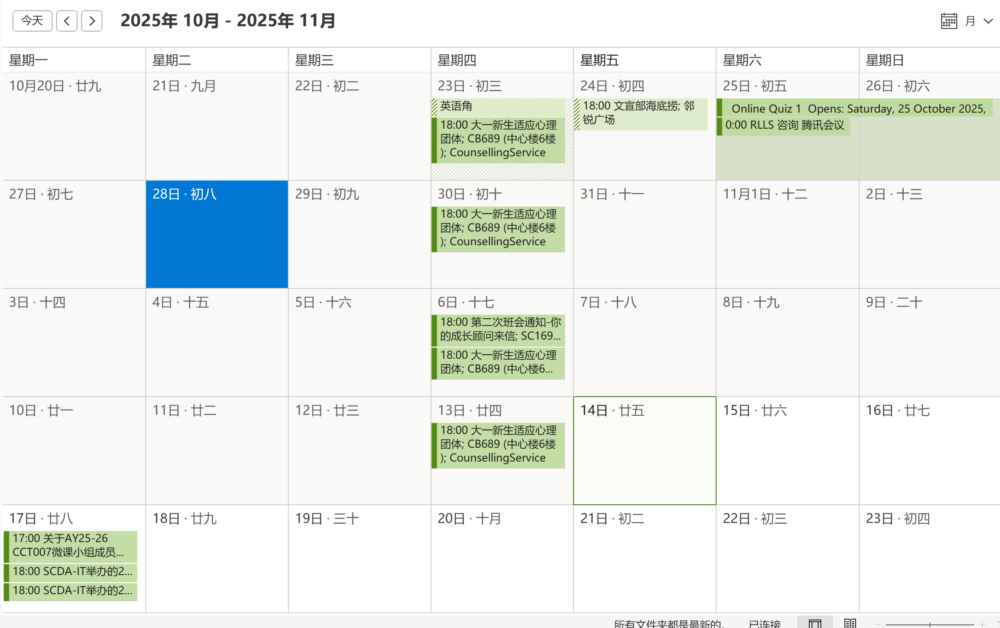

# AI Time Manager - 智能时间管理助手

<p align="center">
  
  
  
  
  


## 🌟 项目简介 / Project Overview

AI Time Manager 是一个专为西交利物浦大学（XJTLU）学生设计的智能时间管理应用。它能绑定西浦eBridge系统，获取课程表并同步到邮箱日历和MS ToDo，同时通过绑定西浦邮箱账号，实现AI读邮件提取日程信息，实现全自动化的日程管理。

AI Time Manager is an intelligent time management application specifically designed for Xi'an Jiaotong-Liverpool University (XJTLU) students. It can automatically bind to XJTLU eBridge system, retrieve course schedules and synchronize them to email calendar and MS ToDo, while intelligently reading emails to extract schedule information, achieving fully automated schedule management.

### 💡 小提示 / Pro Tip
配合手机自带"日历""邮箱"应用，设置日历自动同步邮箱日历使用体验更佳！
For optimal experience, pair with your phone's built-in "Calendar" and "Email" apps by enabling automatic calendar synchronization!

## ✨ 核心功能 / Core Features

### 📧 邮件服务 / Email Services
- **AI自动邮件阅读并提取日程信息** / AI Automatic Email Reading and Schedule Extraction
- **自动创建MS Todo任务** / Automatic Creation of MS Todo Course Tasks

- **自动添加邮箱日历事件** / Automatic Addition of Email Calendar Events

- [待开发] 可选的日程邮件自动确认 / Optional Automatic Confirmation of Schedule Emails

### 🎓 西浦eBridge集成 / XJTLU eBridge Integration
- **课程表自动获取** / Automatic Course Schedule Retrieval
- **MS Todo 课程任务生成** / MS Todo Course Task Generation
- [待开发] 根据module handbook等资料自动生成课程任务 / Automatic Course Task Generation from Module Handbook

### 🔧 其他功能 / Additional Features
- [待开发] 根据语音指令添加日程 / Add Schedule via Voice Commands
- [待开发] 屏幕OCR识别添加日程 / Add Schedule via Screen OCR Recognition
- [开发中] React Native日程管理移动应用 / React Native Mobile Application


## 📦 项目结构 / Project Structure

```
AIdeamon/
├── src/                    # 前端源代码
│   ├── components/         # React 组件
│   │   ├── Dashboard.tsx   # 主仪表板
│   │   ├── Login.tsx       # 登录组件
│   │   └── Register.tsx    # 注册组件
│   ├── services/           # API 服务
│   ├── styles/             # 样式文件
│   └── App.tsx             # 主应用组件
├── server/                 # 后端源代码
│   ├── Services/           # 业务逻辑服务
│   │   ├── MStodo.ts      # Microsoft To Do 服务
│   │   ├── dbService.ts   # 数据库服务
│   │   ├── LLMApi.ts      # AI 服务
│   │   └── exchangeClient.ts # Exchange 服务
│   ├── Utils/              # 工具类
│   │   └── logger.ts       # 日志工具
│   ├── routes/             # API 路由
│   └── index.ts            # 服务端入口
├── dist/                   # 构建输出目录
├── public/                 # 静态资源
└── package.json            # 项目配置
```

## 🚀 快速开始 / Quick Start

### 环境要求 / Prerequisites
- **Node.js** >= 18.0.0
- **npm** >= 8.0.0
- **Python** >= 3.8 (用于 Python 脚本集成)

### 安装依赖 / Install Dependencies

```bash
# 克隆项目 / Clone the project
git clone https://github.com/LIF-D06/AI-Time-Manager.git

# 安装依赖 / Install dependencies
npm install
```

### 环境配置 / Environment Configuration

1. 复制环境模板文件 / Copy environment template:
```bash
cp server/.env.template server/.env
```

2. 配置环境变量 / Configure environment variables:
```env
# 服务器配置 / Server Configuration
PORT=3000

# JWT 配置 / JWT Configuration
JWT_SECRET=your-secret-key-here
JWT_EXPIRES_IN=1h

# Microsoft 认证配置 / Microsoft Authentication
MS_CLIENT_ID=your-microsoft-client-id
MS_CLIENT_SECRET=your-microsoft-client-secret
MS_AUTHORITY=https://login.microsoftonline.com/common

# OpenAI 配置 / OpenAI Configuration
OPENAI_API_KEY=your-openai-api-key
OPENAI_MODEL=gpt-4o

# Exchange 配置 / Exchange Configuration
EXCHANGE_URL=https://your-exchange-server/EWS/Exchange.asmx
EXCHANGE_DOMAIN=your-domain.com
```

### 开发模式 / Development Mode

```bash
# 同时启动前端和后端 / Start both frontend and backend
npm run dev:all

# 单独启动前端 / Start frontend only
npm run dev

# 单独启动后端 / Start backend only
npm run server
```

### 生产构建 / Production Build

```bash
# 构建项目 / Build project
npm run build

# 预览构建结果 / Preview build
npm run preview
```

## 📖 API 文档 / API Documentation

详细的 API 文档请参考 [server/API.md](server/API.md) 文件，其中包含：

- 用户认证接口 / User Authentication APIs
- Microsoft OAuth 流程 / Microsoft OAuth Flow
- JWT 令牌管理 / JWT Token Management
- 错误处理说明 / Error Handling

## 🗓️ 日程与冲突检测 API / Scheduling & Conflict Detection APIs

以下端点均需 `Authorization: Bearer <JWT>`：

1. 创建任务 `POST /api/tasks`
  - 必填：`name,startTime,endTime`
  - 可选：`description,dueDate,location,boundaryConflict`
  - 成功：`201 { task }`
  - 冲突：`409 { error:'conflict', message, candidate, conflicts:[...] }`

2. 批量创建 `POST /api/tasks/batch`
  - 请求：`{ tasks:[{...}], boundaryConflict? }`
  - 响应：`{ results:[{ status, task|conflictList|errorMessage }], summary:{ total, created, conflicts, errors } }`

3. 冲突预检 `POST /api/tasks/conflicts`
  - 请求：`{ startTime, endTime, boundaryConflict? }`
  - 响应：`{ conflicts:[ { id,name,startTime,endTime }, ... ] }`

4. 更新任务 `PUT /api/tasks/:id`
  - 支持部分字段；时间变更触发冲突则 `409`。

5. 删除任务 `DELETE /api/tasks/:id`
  - 响应：`{ id, deleted: true }`

6. 列出任务 `GET /api/tasks?start=&end=&limit=&offset=`
  - 区间过滤 + 分页；响应：`{ tasks, total, limit, offset }`

7. 设置冲突边界模式 `POST /api/settings/conflict-mode`
  - 请求：`{ boundaryConflictInclusive:boolean }`（true=端点相接算冲突）

### 冲突判定优先级 / Conflict Boundary Priority
单项请求级 > 批量顶层 > 用户级（`User.conflictBoundaryInclusive`）。
默认半开区间 `[start, end)`，端点相接不算冲突；若设为 inclusive 则端点相接算冲突。

### 冲突返回示例 / Conflict Response Example
```
{
  "error": "conflict",
  "message": "Schedule time conflict detected",
  "candidate": { "id": "...", "name": "...", "startTime": "...", "endTime": "..." },
  "conflicts": [ { "id": "...", "name": "...", "startTime": "...", "endTime": "..." } ]
}
```

### 示例：创建任务 / Create Task
```
POST /api/tasks
{
  "name": "项目讨论",
  "startTime": "2025-11-16T10:00:00.000Z",
  "endTime": "2025-11-16T11:00:00.000Z",
  "description": "冲刺计划",
  "boundaryConflict": true
}
```

### 示例：批量创建 / Batch Create
```
POST /api/tasks/batch
{
  "tasks": [
   { "name": "A", "startTime": "2025-11-16T09:00:00Z", "endTime": "2025-11-16T10:00:00Z" },
   { "name": "B", "startTime": "2025-11-16T09:30:00Z", "endTime": "2025-11-16T10:30:00Z" }
  ]
}
```

### 示例：更新任务 / Update Task
```
PUT /api/tasks/<taskId>
{
  "startTime": "2025-11-16T12:00:00Z",
  "endTime": "2025-11-16T13:00:00Z",
  "completed": true
}
```

### 示例：设置边界模式 / Set Boundary Mode
## 🔁 重复任务 / Recurring Tasks

创建或批量创建时可传 `recurrenceRule`：
```
{
  "name": "每日晨会",
  "startTime": "2025-11-16T09:00:00Z",
  "endTime": "2025-11-16T09:15:00Z",
  "recurrenceRule": { "freq": "daily", "interval": 1, "count": 5 }
}
```
- freq: `daily` 或 `weekly`
- interval: 间隔（默认 1）
- count: 生成次数（包含根任务时根任务只存规则；系统再生成 count-1 个实例）
- until: 截止日期（与 count 二选一）
根任务存储规则，生成的子实例包含 `parentTaskId` 指回根任务，不再携带 recurrenceRule。
安全限制：未指定 count/until 时最多预生成 30 个实例。

新增字段 `byDay`（仅 freq=weekly 时可用）：
```
"recurrenceRule": {
  "freq": "weekly",
  "interval": 1,
  "byDay": ["Mon", "Wed", "Fri"],
  "count": 10
}
```
表示每周的周一、周三、周五各生成一个实例；若省略 `byDay` 则沿用根任务的星期。同一周内不会重复生成根任务自身日期。

响应现在包含 `recurrenceSummary`：
```
{
  "task": { ... 根任务 ... },
  "recurrenceSummary": {
    "createdInstances": 6,
    "conflictInstances": 0,
    "errorInstances": 0,
    "requestedRule": { "freq": "weekly", "interval":1, "byDay":["Mon","Wed","Fri"], "count":7 }
  }
}
```

## 🔍 任务搜索 / Task Search
GET `/api/tasks?q=keyword&completed=true|false` 同时支持 `start` / `end` / `limit` / `offset`。

## 🔌 WebSocket 事件 / WebSocket Events
连接地址（需附带 JWT）：`ws://<host>/ws?token=<JWT>`
未提供或无效 JWT 会被拒绝（连接立即关闭）。各事件仅推送给所属用户（按 JWT 中 `sub` 隔离）。
事件格式：
1. 欢迎：`{ "type":"welcome", "time":"ISO" }`
2. 任务变更：
```
{
  "type": "taskChange",
  "action": "created" | "updated" | "deleted" | "completed",
  "task": { "id","name","startTime","endTime","completed","parentTaskId","recurrenceRule" }
}
```
3. 任务发生（开始时间到达首次广播）：
```
{
  "type": "taskOccurrence",
  "taskId": "...",
  "name": "...",
  "startTime": "...",
  "endTime": "..."
}
```
去重策略：同一任务仅首次达到开始时间广播一次。

4. 任务发生取消（在开始前被标记完成）：
```
{
  "type": "taskOccurrenceCanceled",
  "taskId": "...",
  "name": "...",
  "startTime": "..."
}
```

客户端处理建议：
- `taskChange.completed` 到达后可立即更新列表中完成状态。
- 收到 `taskOccurrenceCanceled` 时若已排定提醒，可清除本地提醒。

```
POST /api/settings/conflict-mode
{
  "boundaryConflictInclusive": false
}
```


### TypeScript 配置 / TypeScript Configuration

项目包含多个 TypeScript 配置文件：
- `tsconfig.json` - 主配置文件
- `tsconfig.app.json` - 前端配置
- `tsconfig.server.json` - 后端配置
- `tsconfig.node.json` - Node.js 配置

## 🐛 调试与错误处理 / Debugging & Error Handling

### 常见错误 / Common Issues

1. **Microsoft OAuth 配置错误** / Microsoft OAuth configuration errors
   - 检查客户端 ID 和密钥
   - 确保重定向 URI 配置正确

## 🌐 部署 / Deployment

### 生产环境部署 / Production Deployment

1. **构建项目** / Build project:
```bash
npm run build
```

2. **设置环境变量** / Set environment variables:
```bash
export NODE_ENV=production
export PORT=3000
# 其他必要的环境变量 / Other required environment variables
```

3. **启动服务** / Start services:
```bash
npm run server
```

### Docker 部署 / Docker Deployment

```dockerfile
# 示例 Dockerfile / Example Dockerfile
FROM node:18-alpine
WORKDIR /app
COPY package*.json ./
RUN npm ci --only=production
COPY . .
RUN npm run build
EXPOSE 3000
CMD ["npm", "run", "server"]
```

## 🤝 贡献指南 / Contributing

1. **Fork 项目** / Fork the project
2. **创建功能分支** / Create feature branch (`git checkout -b feature/amazing-feature`)
3. **提交更改** / Commit changes (`git commit -m 'Add some amazing feature'`)
4. **推送到分支** / Push to branch (`git push origin feature/amazing-feature`)
5. **创建 Pull Request** / Open a Pull Request


## 📞 支持与联系 / Support & Contact

如有问题或建议，请通过以下方式联系：

- **Issues** - [GitHub Issues](https://github.com/Metalxiaoxiao/AI-Time-Manager/issues)
- **Email** - metalxiaoxiao@foxmail.com
---

<p align="center">
  <b>⭐ 如果这个项目对你有帮助，请给个星标支持！</b><br>
  <b>⭐ If this project helps you, please give it a star!</b>
</p>
